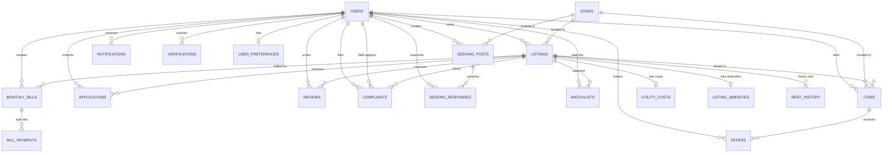

# UIU-Nest — Complete DBMS Documentation

## 1. Technology Stack

| Component | Technology |
|---|---|
| **RDBMS** | MySQL 8.0 (hosted on Railway) |
| **Backend Language** | PHP 8.x |
| **Database Driver** | PDO (PHP Data Objects) with prepared statements |
| **Connection** | DSN-based (`mysql:host=...;port=...;dbname=...;charset=utf8mb4`) |
| **Security** | `PDO::ATTR_EMULATE_PREPARES = false` (native parameterized queries) |
| **Authentication** | `password_hash()` with BCRYPT + `password_verify()` |

---

## 2. Entity-Relationship Diagram (ER Diagram)



---

## 3. Database Schema (19 Tables)

### Table 1: `users`
```sql
CREATE TABLE users (
    user_id INT AUTO_INCREMENT PRIMARY KEY,
    name VARCHAR(100) NOT NULL,
    email VARCHAR(150) UNIQUE NOT NULL,
    password_hash VARCHAR(255) NOT NULL,
    role ENUM('student', 'landlord', 'admin') NOT NULL,
    gender ENUM('male', 'female', 'other') NOT NULL,
    phone VARCHAR(20) NULL,
    university_id VARCHAR(50) NULL UNIQUE,
    profile_pic VARCHAR(255) NULL,
    status ENUM('active', 'suspended') DEFAULT 'active',
    created_at DATETIME DEFAULT CURRENT_TIMESTAMP
);
```
**Key Constraints:** `UNIQUE(email)`, `UNIQUE(university_id)`, `ENUM` for role-based access control.

---

### Table 2: `zones`
```sql
CREATE TABLE zones (
    zone_id INT AUTO_INCREMENT PRIMARY KEY,
    zone_name VARCHAR(100) NOT NULL,
    description TEXT NULL,
    center_lat DECIMAL(9,6) NOT NULL,
    center_lng DECIMAL(9,6) NOT NULL,
    radius_km DECIMAL(4,2) NOT NULL
);
```

---

### Table 3: `listings`
```sql
CREATE TABLE listings (
    listing_id INT AUTO_INCREMENT PRIMARY KEY,
    user_id INT,
    zone_id INT,
    listing_type ENUM('full_property', 'peer_listing') NOT NULL,
    property_type ENUM('single_room', 'shared_room', 'full_mess', 'sublet') NOT NULL,
    title VARCHAR(200) NOT NULL,
    address TEXT NOT NULL,
    lat DECIMAL(9,6) NOT NULL,
    lng DECIMAL(9,6) NOT NULL,
    gender_pref ENUM('male', 'female', 'any') NOT NULL,
    total_rooms INT NOT NULL,
    current_occupancy INT DEFAULT 0,
    status ENUM('available', 'occupied', 'soon_vacant') DEFAULT 'available',
    expected_vacate_date DATE NULL,
    is_verified BOOLEAN DEFAULT FALSE,
    description TEXT NULL,
    photos TEXT NULL,
    created_at DATETIME DEFAULT CURRENT_TIMESTAMP,
    updated_at DATETIME DEFAULT CURRENT_TIMESTAMP ON UPDATE CURRENT_TIMESTAMP,
    FOREIGN KEY (user_id) REFERENCES users(user_id) ON DELETE CASCADE,
    FOREIGN KEY (zone_id) REFERENCES zones(zone_id)
);
```
**Key Constraints:** Two `FOREIGN KEY`s with `ON DELETE CASCADE`, `ON UPDATE CURRENT_TIMESTAMP`.

---

### Table 4: `utility_costs`
```sql
CREATE TABLE utility_costs (
    cost_id INT AUTO_INCREMENT PRIMARY KEY,
    listing_id INT UNIQUE,
    base_rent DECIMAL(10,2) NOT NULL,
    electricity_amount DECIMAL(8,2) DEFAULT 0,
    electricity_type ENUM('individual', 'shared') NOT NULL,
    gas_bill DECIMAL(8,2) DEFAULT 0,
    water_bill DECIMAL(8,2) DEFAULT 0,
    internet_cost DECIMAL(8,2) DEFAULT 0,
    maintenance_fee DECIMAL(8,2) DEFAULT 0,
    caretaker_fee DECIMAL(8,2) DEFAULT 0,
    other_fees DECIMAL(8,2) DEFAULT 0,
    total_monthly DECIMAL(10,2) NOT NULL,
    updated_at DATETIME DEFAULT CURRENT_TIMESTAMP ON UPDATE CURRENT_TIMESTAMP,
    FOREIGN KEY (listing_id) REFERENCES listings(listing_id) ON DELETE CASCADE
);
```
**Key Concept:** One-to-one relationship enforced by `UNIQUE(listing_id)`.

---

### Table 5: `listing_amenities`
```sql
CREATE TABLE listing_amenities (
    amenity_id INT AUTO_INCREMENT PRIMARY KEY,
    listing_id INT UNIQUE,
    attached_bathroom BOOLEAN DEFAULT FALSE,
    attached_kitchen BOOLEAN DEFAULT FALSE,
    is_furnished BOOLEAN DEFAULT FALSE,
    rooftop_access BOOLEAN DEFAULT FALSE,
    parking BOOLEAN DEFAULT FALSE,
    power_backup BOOLEAN DEFAULT FALSE,
    lift_access BOOLEAN DEFAULT FALSE,
    FOREIGN KEY (listing_id) REFERENCES listings(listing_id) ON DELETE CASCADE
);
```

---

### Table 6: `user_preferences`
```sql
CREATE TABLE user_preferences (
    pref_id INT AUTO_INCREMENT PRIMARY KEY,
    user_id INT UNIQUE,
    sleep_schedule ENUM('early', 'late', 'flexible') NOT NULL,
    study_hours INT DEFAULT 0,
    diet ENUM('vegetarian', 'non_veg', 'halal_strict') NOT NULL,
    guest_policy ENUM('allowed', 'restricted', 'not_allowed') NOT NULL,
    smoking_tolerance BOOLEAN DEFAULT FALSE,
    preferred_gender ENUM('male', 'female', 'any') NOT NULL,
    cleanliness_score INT CHECK (cleanliness_score BETWEEN 1 AND 5),
    noise_tolerance ENUM('quiet', 'moderate', 'noisy') NOT NULL,
    FOREIGN KEY (user_id) REFERENCES users(user_id) ON DELETE CASCADE
);
```
**Key Concept:** `CHECK` constraint to enforce valid range (1-5).

---

### Table 7: `reviews`
```sql
CREATE TABLE reviews (
    review_id INT AUTO_INCREMENT PRIMARY KEY,
    listing_id INT,
    reviewer_id INT,
    value_for_money INT CHECK (value_for_money BETWEEN 1 AND 5),
    listing_accuracy INT CHECK (listing_accuracy BETWEEN 1 AND 5),
    landlord_response INT CHECK (landlord_response BETWEEN 1 AND 5),
    cleanliness INT CHECK (cleanliness BETWEEN 1 AND 5),
    safety INT CHECK (safety BETWEEN 1 AND 5),
    composite_score DECIMAL(3,2) NOT NULL,
    comment VARCHAR(500) NULL,
    created_at DATETIME DEFAULT CURRENT_TIMESTAMP,
    UNIQUE(listing_id, reviewer_id),
    FOREIGN KEY (listing_id) REFERENCES listings(listing_id) ON DELETE CASCADE,
    FOREIGN KEY (reviewer_id) REFERENCES users(user_id) ON DELETE CASCADE
);
```
**Key Concept:** Composite `UNIQUE(listing_id, reviewer_id)` prevents duplicate reviews. Multiple `CHECK` constraints.

---

### Table 8: `complaints`
```sql
CREATE TABLE complaints (
    complaint_id INT AUTO_INCREMENT PRIMARY KEY,
    complainant_id INT,
    against_user_id INT,
    listing_id INT NULL,
    category ENUM('hidden_costs', 'harassment', 'deposit_not_returned', 'misrepresentation', 'other') NOT NULL,
    description TEXT NOT NULL,
    status ENUM('submitted', 'under_review', 'resolved') DEFAULT 'submitted',
    created_at DATETIME DEFAULT CURRENT_TIMESTAMP,
    resolved_at DATETIME NULL,
    FOREIGN KEY (complainant_id) REFERENCES users(user_id) ON DELETE CASCADE,
    FOREIGN KEY (against_user_id) REFERENCES users(user_id) ON DELETE CASCADE,
    FOREIGN KEY (listing_id) REFERENCES listings(listing_id) ON DELETE CASCADE
);
```
**Key Concept:** Self-referencing FK pattern (both `complainant_id` and `against_user_id` reference `users`).

---

### Table 9: `seeking_posts`
```sql
CREATE TABLE seeking_posts (
    post_id INT AUTO_INCREMENT PRIMARY KEY,
    user_id INT,
    zone_id INT,
    budget_min DECIMAL(10,2) NOT NULL,
    budget_max DECIMAL(10,2) NOT NULL,
    property_type ENUM('single_room', 'shared_room', 'full_mess', 'sublet', 'any') NOT NULL,
    preferred_gender ENUM('male', 'female', 'any') NOT NULL,
    move_in_date DATE NULL,
    requirements TEXT NULL,
    status ENUM('active', 'fulfilled') DEFAULT 'active',
    created_at DATETIME DEFAULT CURRENT_TIMESTAMP,
    FOREIGN KEY (user_id) REFERENCES users(user_id) ON DELETE CASCADE,
    FOREIGN KEY (zone_id) REFERENCES zones(zone_id)
);
```

---

### Table 10: `monthly_bills`
```sql
CREATE TABLE monthly_bills (
    bill_id INT AUTO_INCREMENT PRIMARY KEY,
    listing_id INT,
    bill_month DATE NOT NULL,
    electricity_amount DECIMAL(8,2) DEFAULT 0,
    gas_amount DECIMAL(8,2) DEFAULT 0,
    water_amount DECIMAL(8,2) DEFAULT 0,
    internet_amount DECIMAL(8,2) DEFAULT 0,
    other_amount DECIMAL(8,2) DEFAULT 0,
    total_amount DECIMAL(10,2) NOT NULL,
    per_person_amount DECIMAL(10,2) NOT NULL,
    created_by INT,
    created_at DATETIME DEFAULT CURRENT_TIMESTAMP,
    FOREIGN KEY (listing_id) REFERENCES listings(listing_id) ON DELETE CASCADE,
    FOREIGN KEY (created_by) REFERENCES users(user_id) ON DELETE CASCADE
);
```

---

### Table 11: `bill_payments`
```sql
CREATE TABLE bill_payments (
    payment_id INT AUTO_INCREMENT PRIMARY KEY,
    bill_id INT,
    resident_user_id INT NULL,
    resident_label VARCHAR(50) NULL,
    status ENUM('paid', 'unpaid') DEFAULT 'unpaid',
    paid_at DATETIME NULL,
    FOREIGN KEY (bill_id) REFERENCES monthly_bills(bill_id) ON DELETE CASCADE,
    FOREIGN KEY (resident_user_id) REFERENCES users(user_id) ON DELETE CASCADE
);
```

---

### Table 12: `rent_history`
```sql
CREATE TABLE rent_history (
    history_id INT AUTO_INCREMENT PRIMARY KEY,
    listing_id INT,
    old_rent DECIMAL(10,2) NOT NULL,
    new_rent DECIMAL(10,2) NOT NULL,
    changed_at DATETIME DEFAULT CURRENT_TIMESTAMP,
    changed_by INT,
    FOREIGN KEY (listing_id) REFERENCES listings(listing_id) ON DELETE CASCADE,
    FOREIGN KEY (changed_by) REFERENCES users(user_id) ON DELETE CASCADE
);
```

---

### Table 13: `items` (Exchange Marketplace)
```sql
CREATE TABLE items (
    item_id INT AUTO_INCREMENT PRIMARY KEY,
    seller_id INT,
    zone_id INT,
    listing_id INT NULL,
    category ENUM('furniture', 'appliances', 'electronics', 'kitchen', 'study', 'other') NOT NULL,
    title VARCHAR(200) NOT NULL,
    description TEXT NULL,
    item_condition ENUM('new', 'like_new', 'good', 'fair') NOT NULL,
    asking_price DECIMAL(10,2) NOT NULL,
    reason_for_selling VARCHAR(300) NULL,
    photo_url VARCHAR(255) NULL,
    status ENUM('available', 'sold', 'withdrawn') DEFAULT 'available',
    created_at DATETIME DEFAULT CURRENT_TIMESTAMP,
    FOREIGN KEY (seller_id) REFERENCES users(user_id) ON DELETE CASCADE,
    FOREIGN KEY (zone_id) REFERENCES zones(zone_id),
    FOREIGN KEY (listing_id) REFERENCES listings(listing_id) ON DELETE SET NULL
);
```
**Key Concept:** `ON DELETE SET NULL` — if the linked listing is deleted, the item remains but its listing_id becomes NULL.

---

### Table 14: `offers`
```sql
CREATE TABLE offers (
    offer_id INT AUTO_INCREMENT PRIMARY KEY,
    item_id INT,
    buyer_id INT,
    offer_price DECIMAL(10,2) NOT NULL,
    message VARCHAR(300) NULL,
    status ENUM('pending', 'countered', 'accepted', 'rejected', 'withdrawn') DEFAULT 'pending',
    counter_price DECIMAL(10,2) NULL,
    created_at DATETIME DEFAULT CURRENT_TIMESTAMP,
    updated_at DATETIME DEFAULT CURRENT_TIMESTAMP ON UPDATE CURRENT_TIMESTAMP,
    FOREIGN KEY (item_id) REFERENCES items(item_id) ON DELETE CASCADE,
    FOREIGN KEY (buyer_id) REFERENCES users(user_id) ON DELETE CASCADE
);
```
**Key Concept:** State machine pattern with ENUM statuses for negotiation workflow.

---

### Table 15: `applications`
```sql
CREATE TABLE applications (
    application_id INT AUTO_INCREMENT PRIMARY KEY,
    listing_id INT,
    applicant_id INT,
    message TEXT NULL,
    status ENUM('pending', 'accepted', 'rejected') DEFAULT 'pending',
    created_at DATETIME DEFAULT CURRENT_TIMESTAMP,
    FOREIGN KEY (listing_id) REFERENCES listings(listing_id) ON DELETE CASCADE,
    FOREIGN KEY (applicant_id) REFERENCES users(user_id) ON DELETE CASCADE
);
```

---

### Table 16: `verifications`
```sql
CREATE TABLE verifications (
    verification_id INT AUTO_INCREMENT PRIMARY KEY,
    user_id INT,
    nid_type ENUM('National ID', 'Passport', 'Driving License') NOT NULL,
    document_path VARCHAR(255) NOT NULL,
    description TEXT NULL,
    status ENUM('pending', 'approved', 'rejected') DEFAULT 'pending',
    submitted_at DATETIME DEFAULT CURRENT_TIMESTAMP,
    FOREIGN KEY (user_id) REFERENCES users(user_id) ON DELETE CASCADE
);
```

---

### Table 17: `watchlists`
```sql
CREATE TABLE watchlists (
    watchlist_id INT AUTO_INCREMENT PRIMARY KEY,
    user_id INT,
    listing_id INT,
    added_at DATETIME DEFAULT CURRENT_TIMESTAMP,
    UNIQUE(user_id, listing_id),
    FOREIGN KEY (user_id) REFERENCES users(user_id) ON DELETE CASCADE,
    FOREIGN KEY (listing_id) REFERENCES listings(listing_id) ON DELETE CASCADE
);
```
**Key Concept:** Composite `UNIQUE(user_id, listing_id)` prevents duplicate watchlist entries.

---

### Table 18: `seeking_responses`
```sql
CREATE TABLE seeking_responses (
    response_id INT AUTO_INCREMENT PRIMARY KEY,
    post_id INT,
    responder_id INT,
    message TEXT NULL,
    status ENUM('pending', 'accepted', 'rejected') DEFAULT 'pending',
    created_at DATETIME DEFAULT CURRENT_TIMESTAMP,
    FOREIGN KEY (post_id) REFERENCES seeking_posts(post_id) ON DELETE CASCADE,
    FOREIGN KEY (responder_id) REFERENCES users(user_id) ON DELETE CASCADE
);
```

---

### Table 19: `notifications`
```sql
CREATE TABLE notifications (
    notif_id INT AUTO_INCREMENT PRIMARY KEY,
    user_id INT,
    type VARCHAR(50),
    message TEXT,
    is_read BOOLEAN DEFAULT FALSE,
    link VARCHAR(255) NULL,
    created_at DATETIME DEFAULT CURRENT_TIMESTAMP,
    FOREIGN KEY (user_id) REFERENCES users(user_id) ON DELETE CASCADE
);
```

---

## 4. All SQL Queries Used (By Module)

### 4.1 Authentication & Registration

```sql
-- Login: Find user by email or university ID
SELECT * FROM users WHERE email = ? OR university_id = ?;

-- Login: Fetch user preferences after authentication
SELECT * FROM user_preferences WHERE user_id = ?;

-- Register: Insert new user
INSERT INTO users (name, email, password_hash, role, gender, university_id) VALUES (?, ?, ?, ?, ?, ?);
```

---

### 4.2 Listings (CRUD + Multi-table JOINs)

```sql
-- GET: Fetch all listings with zone, owner, and preferences (4-table JOIN)
SELECT l.*, z.zone_name as zone, u.name as owner_name, u.email as owner_email,
       up.sleep_schedule as sleep, up.diet, up.guest_policy as guest, 
       up.smoking_tolerance as smoking, up.noise_tolerance as noise, up.cleanliness_score as cleanliness
FROM listings l
LEFT JOIN zones z ON l.zone_id = z.zone_id
LEFT JOIN users u ON l.user_id = u.user_id
LEFT JOIN user_preferences up ON l.user_id = up.user_id;

-- GET: Fetch all utility costs
SELECT * FROM utility_costs;

-- GET: Fetch all amenities
SELECT * FROM listing_amenities;

-- GET: Fetch all reviews with reviewer name (JOIN)
SELECT r.*, u.name as reviewer_name 
FROM reviews r
LEFT JOIN users u ON r.reviewer_id = u.user_id
ORDER BY r.created_at DESC;

-- POST: Create listing (Transaction with 3 INSERTs)
BEGIN TRANSACTION;
INSERT INTO listings (...) VALUES (...);
INSERT INTO utility_costs (...) VALUES (...);
INSERT INTO listing_amenities (...) VALUES (...);
COMMIT;

-- PUT: Update listing (Transaction with 3 UPDATEs)
BEGIN TRANSACTION;
UPDATE listings SET zone_id=?, property_type=?, title=?, address=?, ... WHERE listing_id=?;
UPDATE utility_costs SET base_rent=?, electricity_amount=?, ... WHERE listing_id=?;
UPDATE listing_amenities SET attached_bathroom=?, ... WHERE listing_id=?;
COMMIT;

-- DELETE: Delete listing (cascades to costs, amenities, reviews, applications, etc.)
DELETE FROM listings WHERE listing_id = ?;

-- Authorization check before update/delete
SELECT user_id FROM listings WHERE listing_id = ?;
```

---

### 4.3 Exchange Marketplace (Items)

```sql
-- GET: Fetch all items with seller and zone info (3-table JOIN)
SELECT i.*, u.name as seller, u.email as seller_email, z.zone_name as zone 
FROM items i
LEFT JOIN users u ON i.seller_id = u.user_id
LEFT JOIN zones z ON i.zone_id = z.zone_id
ORDER BY i.created_at DESC;

-- POST: Create new item
INSERT INTO items (seller_id, zone_id, listing_id, category, title, description, item_condition, asking_price, photo_url, photos)
VALUES (?, ?, ?, ?, ?, ?, ?, ?, ?, ?);

-- PUT: Update item (with ownership check)
UPDATE items SET title = ?, asking_price = ?, item_condition = ? WHERE item_id = ? AND seller_id = ?;

-- DELETE: Delete item (with ownership check)
DELETE FROM items WHERE item_id = ? AND seller_id = ?;
```

---

### 4.4 Offers & Negotiation (State Machine)

```sql
-- POST: Check for duplicate active offers before inserting
SELECT offer_id FROM offers WHERE item_id = ? AND buyer_id = ? AND status IN ('pending', 'countered', 'accepted');

-- POST: Insert new offer
INSERT INTO offers (item_id, buyer_id, offer_price, message) VALUES (?, ?, ?, ?);

-- POST: Notify seller (cross-table lookup)
SELECT seller_id, title FROM items WHERE item_id = ?;
INSERT INTO notifications (user_id, type, message, link) VALUES (?, 'offer', ?, ?);

-- GET: Fetch all offers for an item with buyer details (JOIN)
SELECT o.*, u.name as buyer_name, u.email as buyer_email, u.phone as buyer_phone
FROM offers o 
JOIN users u ON o.buyer_id = u.user_id 
WHERE o.item_id = ? 
ORDER BY o.created_at DESC;

-- PUT: Counter an offer (update with counter price)
UPDATE offers SET status = ?, counter_price = ?, message = 'Seller countered the offer' WHERE offer_id = ?;

-- PUT: Accept/Reject offer
UPDATE offers SET status = ? WHERE offer_id = ?;

-- PUT: Mark item as sold when offer is accepted
UPDATE items SET status = 'sold' WHERE item_id = ?;

-- PUT: Authorization check (JOIN offers with items)
SELECT o.*, i.seller_id, i.title, o.buyer_id 
FROM offers o 
JOIN items i ON o.item_id = i.item_id 
WHERE o.offer_id = ?;

-- DELETE: Withdraw offer (with ownership check)
DELETE FROM offers WHERE offer_id = ? AND buyer_id = ?;
```

---

### 4.5 Housing Applications

```sql
-- POST: Check for existing pending application
SELECT application_id FROM applications WHERE listing_id = ? AND applicant_id = ? AND status = 'pending';

-- POST: Submit application
INSERT INTO applications (listing_id, applicant_id, message) VALUES (?, ?, ?);

-- POST: Notify listing owner (cross-table lookup)
SELECT user_id, title FROM listings WHERE listing_id = ?;

-- PUT: Accept/Reject application (with owner authorization via JOIN)
SELECT a.*, l.user_id as owner_id, l.title 
FROM applications a 
JOIN listings l ON a.listing_id = l.listing_id 
WHERE a.application_id = ?;

UPDATE applications SET status = ? WHERE application_id = ?;

-- PUT: Auto-mark listing as occupied when application accepted
UPDATE listings SET status = 'occupied' WHERE listing_id = ?;
```

---

### 4.6 Monthly Billing & Payments

```sql
-- GET: Fetch all bills for a listing
SELECT * FROM monthly_bills WHERE listing_id = ? ORDER BY created_at DESC;

-- GET: Fetch payment splits for each bill
SELECT * FROM bill_payments WHERE bill_id = ?;

-- POST: Check if bill already exists for this month
SELECT bill_id FROM monthly_bills WHERE listing_id = ? AND bill_month = ?;

-- POST: Insert new bill (Transaction)
BEGIN TRANSACTION;
INSERT INTO monthly_bills (listing_id, bill_month, electricity_amount, gas_amount, water_amount, internet_amount, other_amount, custom_fees, total_amount, per_person_amount, created_by)
VALUES (?, ?, ?, ?, ?, ?, ?, ?, ?, ?, ?);
INSERT INTO bill_payments (bill_id, resident_label, status) VALUES (?, ?, 'unpaid');  -- repeated per occupant
COMMIT;

-- POST: Update existing bill
UPDATE monthly_bills SET electricity_amount=?, gas_amount=?, water_amount=?, internet_amount=?, other_amount=?, custom_fees=?, total_amount=?, per_person_amount=? WHERE bill_id=?;

-- PUT: Mark payment as paid
UPDATE bill_payments SET status = 'paid', paid_at = NOW() WHERE payment_id = ?;

-- DELETE: Delete bill and its payments (Transaction)
BEGIN TRANSACTION;
DELETE FROM bill_payments WHERE bill_id = ?;
DELETE FROM monthly_bills WHERE bill_id = ? AND created_by = ?;
COMMIT;
```

---

### 4.7 Reviews

```sql
-- POST: Insert review with composite score calculation
INSERT INTO reviews (listing_id, reviewer_id, value_for_money, listing_accuracy, landlord_response, cleanliness, safety, composite_score, comment)
VALUES (?, ?, ?, ?, ?, ?, ?, ?, ?);
-- Duplicate review blocked by UNIQUE(listing_id, reviewer_id) constraint
```

---

### 4.8 Complaints

```sql
-- POST: File a complaint
INSERT INTO complaints (complainant_id, against_user_id, listing_id, category, description, status, document_path) 
VALUES (?, ?, ?, ?, ?, 'submitted', ?);
```

---

### 4.9 Seeking Posts & Responses

```sql
-- GET: Fetch all active seeking posts (3-table JOIN)
SELECT s.*, u.name as user_name, u.gender as user_gender, z.zone_name as zone 
FROM seeking_posts s
JOIN users u ON s.user_id = u.user_id
JOIN zones z ON s.zone_id = z.zone_id
WHERE s.status = 'active'
ORDER BY s.created_at DESC;

-- POST: Create seeking post
INSERT INTO seeking_posts (user_id, zone_id, budget_min, budget_max, property_type, preferred_gender, move_in_date, requirements)
VALUES (?, ?, ?, ?, ?, ?, ?, ?);

-- DELETE: Remove seeking post (with ownership check)
DELETE FROM seeking_posts WHERE post_id = ? AND user_id = ?;
```

---

### 4.10 Notifications

```sql
-- GET: Fetch user notifications (with LIMIT)
SELECT * FROM notifications WHERE user_id = ? ORDER BY created_at DESC LIMIT 50;

-- POST: Mark single notification as read
UPDATE notifications SET is_read = TRUE WHERE notif_id = ? AND user_id = ?;

-- POST: Mark ALL notifications as read (bulk update)
UPDATE notifications SET is_read = TRUE WHERE user_id = ?;

-- INSERT: Create notification (used across multiple modules)
INSERT INTO notifications (user_id, type, message, link) VALUES (?, ?, ?, ?);
```

---

### 4.11 Watchlist (Toggle Pattern)

```sql
-- GET: Fetch user's watchlisted listing IDs
SELECT listing_id FROM watchlists WHERE user_id = ?;

-- POST: Check if already watchlisted
SELECT watchlist_id FROM watchlists WHERE user_id = ? AND listing_id = ?;

-- POST: Add to watchlist
INSERT INTO watchlists (user_id, listing_id) VALUES (?, ?);

-- POST: Remove from watchlist
DELETE FROM watchlists WHERE watchlist_id = ?;
```

---

### 4.12 User Profile & Preferences (UPSERT Pattern)

```sql
-- GET: Fetch profile
SELECT name, email, phone, university_id, gender, role, profile_pic FROM users WHERE user_id = ?;

-- GET: Fetch preferences
SELECT * FROM user_preferences WHERE user_id = ?;

-- POST: Update basic profile
UPDATE users SET name = ?, email = ?, phone = ?, university_id = ?, profile_pic = ? WHERE user_id = ?;

-- POST: Check email uniqueness (excluding self)
SELECT user_id FROM users WHERE email = ? AND user_id != ?;

-- POST: Check if preferences exist (UPSERT logic)
SELECT pref_id FROM user_preferences WHERE user_id = ?;

-- POST: Update existing preferences
UPDATE user_preferences SET sleep_schedule=?, study_hours=?, diet=?, guest_policy=?, smoking_tolerance=?, preferred_gender=?, cleanliness_score=?, noise_tolerance=? WHERE user_id=?;

-- POST: Insert new preferences
INSERT INTO user_preferences (user_id, sleep_schedule, study_hours, diet, guest_policy, smoking_tolerance, preferred_gender, cleanliness_score, noise_tolerance) VALUES (?, ?, ?, ?, ?, ?, ?, ?, ?);
```

---

### 4.13 Verification System

```sql
-- POST: Check for existing pending/approved verification
SELECT * FROM verifications WHERE user_id = ? AND status IN ('pending', 'approved');

-- POST: Submit verification request
INSERT INTO verifications (user_id, nid_type, document_path, description, status) VALUES (?, ?, ?, ?, 'pending');

-- GET: Check verification status (Dashboard)
SELECT status FROM verifications WHERE user_id = ? ORDER BY submitted_at DESC LIMIT 1;
```

---

### 4.14 Admin Panel (Aggregation & Analytics)

```sql
-- Total listings count
SELECT COUNT(*) FROM listings;

-- Open complaints count
SELECT COUNT(*) FROM complaints WHERE status != 'resolved';

-- Average rent by zone (3-table JOIN + GROUP BY + Aggregation)
SELECT z.zone_name as zone, COALESCE(AVG(uc.total_monthly), 0) as avg
FROM zones z
LEFT JOIN listings l ON z.zone_id = l.zone_id
LEFT JOIN utility_costs uc ON l.listing_id = uc.listing_id
GROUP BY z.zone_id, z.zone_name;

-- Seeking vs Listings comparison (Correlated Subqueries)
SELECT 
    z.zone_name as zone,
    (SELECT COUNT(*) FROM seeking_posts sp WHERE sp.zone_id = z.zone_id AND sp.status = 'active') as seeking,
    (SELECT COUNT(*) FROM listings l WHERE l.zone_id = z.zone_id) as listings
FROM zones z;

-- Fetch all complaints with user and listing info (3-table JOIN + DATE_FORMAT)
SELECT 
    c.complaint_id as id, c.complainant_id as userId, u.email as userEmail,
    c.against_user_id as ownerId, c.listing_id as listingId, l.title as listingTitle,
    c.category, c.description, c.status, c.document_path,
    DATE_FORMAT(c.created_at, '%Y-%m-%d') as date
FROM complaints c
LEFT JOIN users u ON c.complainant_id = u.user_id
LEFT JOIN listings l ON c.listing_id = l.listing_id
ORDER BY c.created_at DESC;

-- Admin: Delete listing
DELETE FROM listings WHERE listing_id = ?;

-- Admin: Suspend/Activate user
UPDATE users SET status = ? WHERE user_id = ?;

-- Admin: Approve/Reject verification
UPDATE verifications SET status = ? WHERE verification_id = ?;
```

---

### 4.15 Dashboard (Complex Multi-table JOINs)

```sql
-- My listings with zone and cost info (3-table JOIN)
SELECT l.*, z.zone_name, c.total_monthly 
FROM listings l 
JOIN zones z ON l.zone_id = z.zone_id 
LEFT JOIN utility_costs c ON l.listing_id = c.listing_id
WHERE l.user_id = ?
ORDER BY l.created_at DESC;

-- My exchange items
SELECT * FROM items WHERE seller_id = ? ORDER BY created_at DESC;

-- My watchlisted listings (4-table JOIN)
SELECT l.*, z.zone_name, c.total_monthly, c.base_rent
FROM watchlists w
JOIN listings l ON w.listing_id = l.listing_id
JOIN zones z ON l.zone_id = z.zone_id
LEFT JOIN utility_costs c ON l.listing_id = c.listing_id
WHERE w.user_id = ?
ORDER BY w.added_at DESC;

-- Offers I sent (3-table JOIN)
SELECT o.*, i.title, u.name as seller_name, u.email as seller_email, u.phone as seller_phone 
FROM offers o 
JOIN items i ON o.item_id = i.item_id 
JOIN users u ON i.seller_id = u.user_id 
WHERE o.buyer_id = ?
ORDER BY o.created_at DESC;

-- Offers I received (3-table JOIN)
SELECT o.*, i.title, u.name as buyer_name, u.email as buyer_email, u.phone as buyer_phone 
FROM offers o 
JOIN items i ON o.item_id = i.item_id 
JOIN users u ON o.buyer_id = u.user_id 
WHERE i.seller_id = ?
ORDER BY o.created_at DESC;

-- Applications I sent (3-table JOIN)
SELECT a.*, l.title as listing_title, u.email as owner_email, u.name as owner_name, u.phone as owner_phone 
FROM applications a 
JOIN listings l ON a.listing_id = l.listing_id 
JOIN users u ON l.user_id = u.user_id 
WHERE a.applicant_id = ?
ORDER BY a.created_at DESC;

-- Applications I received (3-table JOIN)
SELECT a.*, l.title as listing_title, u.name as applicant_name, u.email as applicant_email, u.phone as applicant_phone 
FROM applications a 
JOIN listings l ON a.listing_id = l.listing_id 
JOIN users u ON a.applicant_id = u.user_id 
WHERE l.user_id = ?
ORDER BY a.created_at DESC;

-- My seeking posts (JOIN)
SELECT s.*, z.zone_name as zone 
FROM seeking_posts s 
LEFT JOIN zones z ON s.zone_id = z.zone_id 
WHERE s.user_id = ?
ORDER BY s.created_at DESC;

-- Seeking responses I sent (3-table JOIN)
SELECT r.*, u.email as owner_email, u.name as owner_name, u.phone as owner_phone, s.requirements 
FROM seeking_responses r 
JOIN seeking_posts s ON r.post_id = s.post_id 
JOIN users u ON s.user_id = u.user_id 
WHERE r.responder_id = ?
ORDER BY r.created_at DESC;

-- Seeking responses I received (3-table JOIN)
SELECT r.*, u.name as responder_name, u.email as responder_email, u.phone as responder_phone 
FROM seeking_responses r 
JOIN seeking_posts s ON r.post_id = s.post_id 
JOIN users u ON r.responder_id = u.user_id 
WHERE s.user_id = ?
ORDER BY r.created_at DESC;
```

---

## 5. Key DBMS Concepts Demonstrated

| Concept | Where Used |
|---|---|
| **Multi-table JOINs** (2, 3, 4 tables) | Listings GET (4-table), Dashboard (3-table), Admin complaints (3-table) |
| **LEFT JOIN vs INNER JOIN** | LEFT JOIN for optional data (costs, amenities), INNER JOIN for required relationships |
| **Transactions** (`BEGIN`, `COMMIT`, `ROLLBACK`) | Listing creation, bill creation, offer acceptance, application processing |
| **Aggregate Functions** (`COUNT`, `AVG`, `COALESCE`) | Admin stats, composite review score |
| **GROUP BY** | Average rent by zone |
| **Correlated Subqueries** | Seeking vs Listings comparison per zone |
| **ENUM Types** | Roles, statuses, categories, preferences (used extensively) |
| **CHECK Constraints** | Review scores (1-5), cleanliness score (1-5) |
| **UNIQUE Constraints** | Email, university_id, composite (listing+reviewer), composite (user+listing watchlist) |
| **Foreign Keys** with `ON DELETE CASCADE` | All child tables cascade-delete when parent is removed |
| **Foreign Keys** with `ON DELETE SET NULL` | Items linked to deleted listings keep their record |
| **AUTO_INCREMENT** Primary Keys | All 19 tables |
| **DEFAULT Values** | Status defaults, timestamps, boolean defaults |
| **ON UPDATE CURRENT_TIMESTAMP** | `listings.updated_at`, `utility_costs.updated_at`, `offers.updated_at` |
| **Prepared Statements** (SQL Injection Prevention) | Every single query uses `?` parameterized placeholders via PDO |
| **UPSERT Pattern** (Check → Insert/Update) | User preferences, monthly bills |
| **Toggle Pattern** (Check → Insert/Delete) | Watchlist add/remove |
| **Duplicate Prevention** | Applications (pending check), Offers (active check), Reviews (UNIQUE constraint) |
| **State Machine** via ENUM | Offers: pending → countered → accepted/rejected/withdrawn |
| **Cross-table Side Effects** | Accepting offer → marks item as 'sold'; Accepting application → marks listing as 'occupied' |
| **Pagination / Limiting** | `LIMIT 50` on notifications, `ORDER BY ... DESC LIMIT 1` for latest verification |
| **Date Functions** | `NOW()`, `DATE_FORMAT()`, `CURRENT_TIMESTAMP` |
| **Password Hashing** | `password_hash()` with BCRYPT, verified via `password_verify()` |
| **Session-based Auth** | `$_SESSION['user_id']` checked in every protected endpoint |

---

## 6. Seed Data

```sql
-- Zones
INSERT INTO zones (zone_name, description, center_lat, center_lng, radius_km) VALUES
('UIU Campus Area', 'Immediate surroundings of UIU', 23.7979, 90.4497, 1.5),
('Sayed Nagar', 'Residential area close to campus', 23.7950, 90.4440, 2.0),
('Shatarkul', 'Quiet neighborhood', 23.7910, 90.4350, 2.5),
('Nurer Chala', 'Bustling commercial and residential area', 23.8050, 90.4380, 2.0),
('Aftabnagar', 'Planned residential sector', 23.7660, 90.4340, 3.0),
('Notun Bazar', 'Major transit and shopping hub', 23.7970, 90.4220, 2.5);

-- Users (password = 'password' hashed with BCRYPT)
INSERT INTO users (name, email, password_hash, role, gender, university_id) VALUES
('Student User', 'student@uiu.ac.bd', '$2y$10$...', 'student', 'male', '011202001'),
('Student Two', 'student2@uiu.ac.bd', '$2y$10$...', 'student', 'female', '011202002'),
('Landlord User', 'landlord@uiu.ac.bd', '$2y$10$...', 'landlord', 'male', NULL),
('Master Admin', 'admin@uiu.ac.bd', '$2y$10$...', 'admin', 'male', NULL);

-- Listings with costs and amenities
INSERT INTO listings (...) VALUES (...);
INSERT INTO utility_costs (...) VALUES (...);
INSERT INTO listing_amenities (...) VALUES (...);
```

---

## 7. Summary Statistics

| Metric | Count |
|---|---|
| **Total Tables** | 19 |
| **Total Foreign Keys** | 30+ |
| **Total ENUM Types** | 25+ |
| **Total API Endpoints (PHP files)** | 34 |
| **Distinct SQL Query Types** | SELECT, INSERT, UPDATE, DELETE, TRUNCATE, ALTER |
| **JOINs Used** | LEFT JOIN, INNER JOIN (2-table, 3-table, 4-table) |
| **Transactions Used** | 8+ locations (listings, bills, offers, applications) |
| **Aggregate Functions** | COUNT, AVG, COALESCE |
| **Subqueries** | Correlated subqueries in admin stats |
